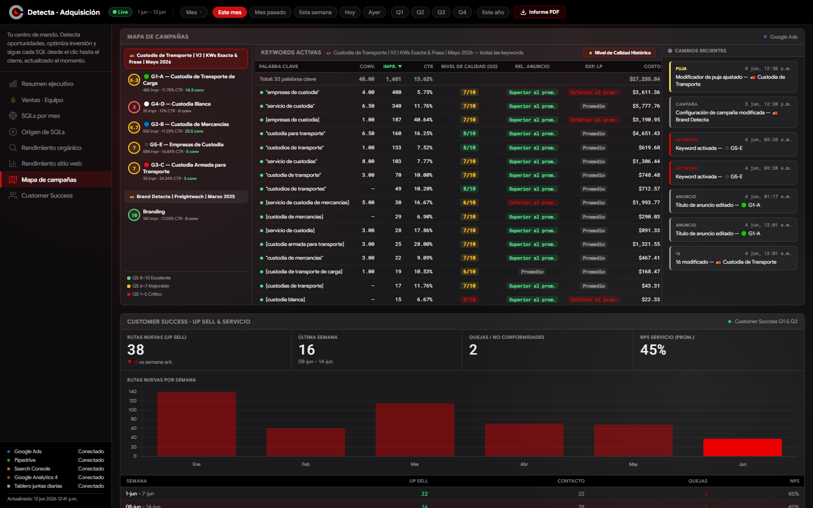
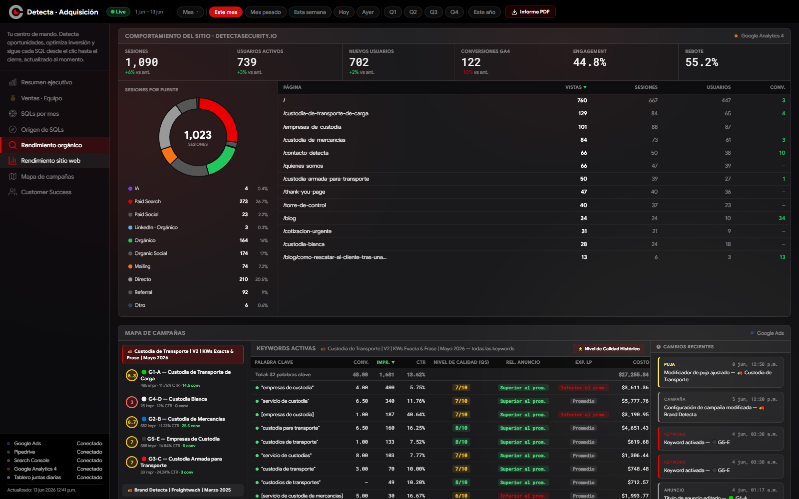

# Dashboard de Adquisición

Dashboard interno para visualizar métricas de adquisición de Detecta Security: campañas de Google Ads, pipeline de ventas (Pipedrive), tráfico web (Google Analytics 4), posicionamiento orgánico (Search Console), tablero operativo desde Google Sheets e informes de marketing en PDF.

## Capturas

### Resumen ejecutivo


### Origen de SQLs y embudo de conversión


### Mapa de campañas


### Rendimiento del sitio (GA4)


## Stack

- Node.js + Express
- HTML/CSS/JS vanilla (sin frameworks frontend)
- Google Ads API
- Pipedrive API
- Google Analytics 4 Data API
- Google Search Console API
- Google Sheets API (tablero operativo y estadísticas de subasta)
- Anthropic API (chat de consultas sobre el dashboard)

## Configuración

1. Instalar dependencias:
   ```
   npm install
   ```
2. Crear un archivo `.env` con las credenciales necesarias (ver variables usadas en `index.js`):
   - `GOOGLE_ADS_*`
   - `PIPEDRIVE_*`
   - `GA4_PROPERTY_ID`
   - `GSC_*`
   - `GOOGLE_SHEETS_AUCTION_ID`
   - `ANTHROPIC_API_KEY`

3. Iniciar el servidor:
   ```
   npm start
   ```

En local, el dashboard estará disponible en `http://localhost:3000` (o el puerto configurado).
