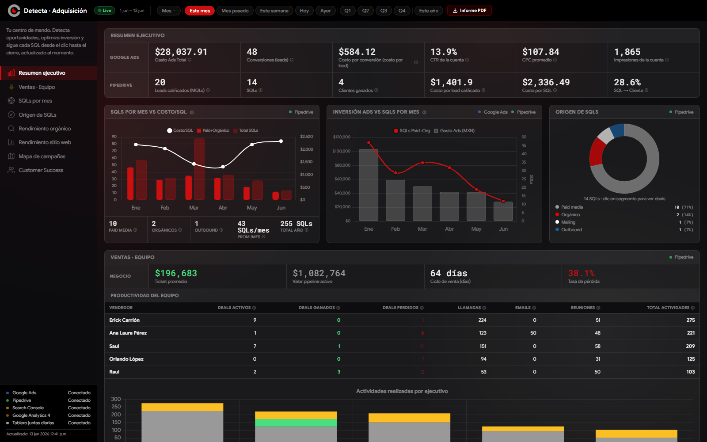
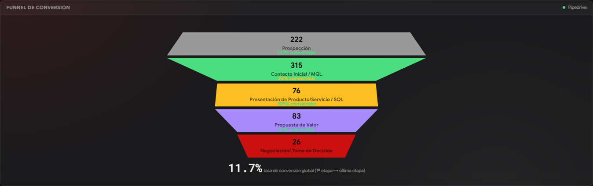

# Dashboard de Adquisición

Dashboard interno para visualizar métricas de adquisición de Detecta Security: campañas de Google Ads, pipeline de ventas (Pipedrive), tráfico web (Google Analytics 4), posicionamiento orgánico (Search Console), tablero operativo desde Google Sheets e informes de marketing en PDF.

## Por qué existe

Su propósito principal es **cruzar métricas de distintas fuentes** (Google Ads, Pipedrive, GA4, Search Console, Sheets) que antes vivían aisladas en cada plataforma, para responder preguntas que ninguna herramienta por sí sola contesta: qué campañas generan los SQLs que sí cierran, cómo se relaciona el tráfico orgánico con el pipeline, etc.

Se construyó a la medida (en vez de usar Looker Studio u otra herramienta de BI genérica) **pensando en escalabilidad por diseño**: cada fuente se integra como un módulo independiente, lo que permite ir agregando nuevas métricas, cruces y vistas sin estar limitado por los conectores o el modelo de datos de una herramienta de terceros.

## Capturas

### Resumen ejecutivo


### Embudo de conversión


## Stack

- Node.js + Express
- HTML/CSS/JS vanilla (sin frameworks frontend) — sin paso de build, despliegue simple y directo
- Google Ads API
- Pipedrive API
- Google Analytics 4 Data API
- Google Search Console API
- Google Sheets API (tablero operativo y estadísticas de subasta)
- Anthropic API (chat de consultas sobre el dashboard)

## Limitantes actuales

- Sin base de datos: todo se calcula al vuelo consultando las APIs externas en cada carga, lo que depende de su disponibilidad y límites de cuota.
- Sin autenticación: pensado para uso interno detrás de un acceso controlado, no para exponerse públicamente.
- Sin pruebas automatizadas.
- El frontend vanilla facilita el arranque rápido, pero a medida que crezcan las vistas convendría migrar a un framework para mantenibilidad.

## Configuración

1. Instalar dependencias:
   ```
   npm install
   ```
2. Crear un archivo `.env` con las credenciales necesarias (ver variables usadas en `index.js`):
   - `GOOGLE_ADS_*`
   - `PIPEDRIVE_*`
   - `GA4_PROPERTY_ID`
   - `GSC_*`
   - `GOOGLE_SHEETS_AUCTION_ID`
   - `ANTHROPIC_API_KEY`

3. Iniciar el servidor:
   ```
   npm start
   ```

En local, el dashboard estará disponible en `http://localhost:3000` (o el puerto configurado).
